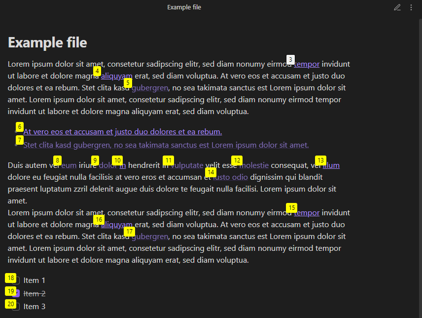

# Obsidian Navigator

## Introduction
Obsidian Navigator is a powerful navigation plugin for Obsidian, inspired by the Vimium browser extension. It enhances the user experience in Obsidian by introducing efficient keyboard-based navigation and link selection features, enabling users to navigate their notes more fluidly and intuitively.

## Features
- **Keyboard Navigation**: Navigate through notes using Vimium-like keybindings.
- **Link Selection Mode**: Easily select and open links using keyboard shortcuts.
- **Configurable Scroll Speed**: Customize the scroll speed to suit your preference.
- **Read-Mode Specific**: Functionality is tailored to work exclusively in Obsidian's read mode, ensuring seamless integration with your workflow.

## Installation
To install Obsidian Navigator:
1. Download the latest release from the [GitHub repository](#).
2. Copy the plugin into `<your-vault>/.obsidian/plugins/`
3. In Obsidian, open Settings > Community Plugins.
4. Disable Safe Mode.
5. Enable the plugin.

## Usage
- `j`: Scroll down in the current note.
- `k`: Scroll up in the current note.
- `f`: Enter link selection mode. Type characters to filter links and press the corresponding number to open a link.
- `Esc`: Exit link selection mode.
- `x`: Close the current note.

## Configuration
Customize the scroll speed by navigating to the plugin settings in Obsidian:
1. Open Settings > Obsidian Navigator.
2. Adjust the 'Scroll Speed' slider to your liking.

---

*Note: This plugin is not officially affiliated with the Obsidian note-taking application.*
